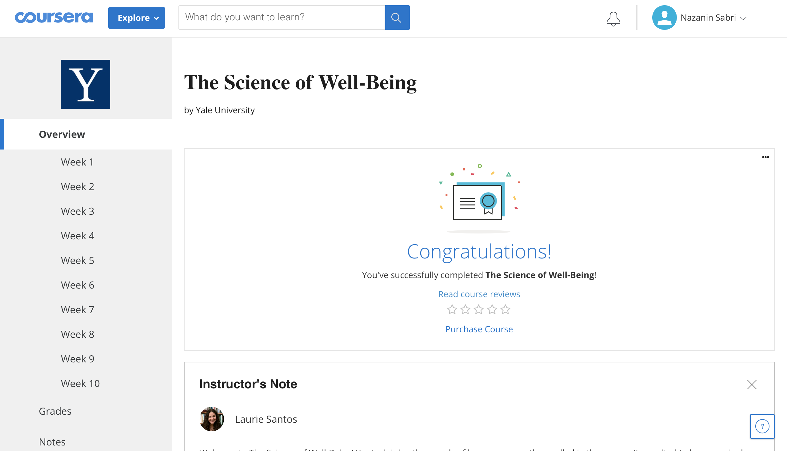
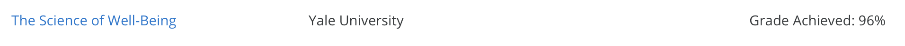
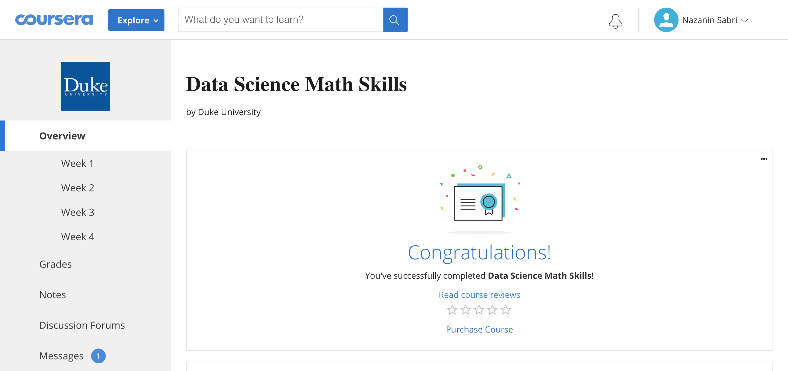
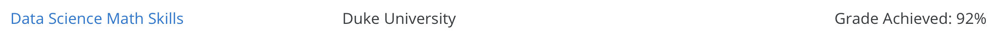

# Online-Courses

## You can view the official course certificates <a href="http://nazanin-sabri.com/wp-content/uploads/2020/06/Certificates.pdf">here</a>
<ol>
  <li>Neural Networks and Deep Learning (Coursera)</li>
  <li>Improving Deep Neural Networks: Hyperparameter tuning, Regularization and Optimization (Coursera)</li>
  <li>Structuring Machine Learning Projects (Coursera)</li>
  <li>Convolutional Neural Networks (Coursera)</li>
  <li>Sequence Models (Coursera)</li>
  <li>Computational Social Science Methods (Coursera)</li>
  <li>Big Data, Artificial Intelligence, and Ethics (Coursera)</li>
  <li>Social Network Analysis (Coursera)</li>
  <li>Computer Simulations (Coursera)</li>
  <li>Computational Social Science Capstone Project (Coursera)</li>

  <li>The Science of Well-Being
	<ul>
		<li></li>
		<li></li>
	</ul>
  </li>
  <li>Python and Statistics for Financial Analysis
	<ul>
		<li></li>
		<li></li>
	</ul>
  </li>
  <li>Data Science Math Skills
	<ul>
		<li></li>
		<li></li>
	</ul>
  </li>
  <li>Understanding Research Methods
	<ul>
		<li></li>
		<li></li>
	</ul>
  </li>
</ol>
