# Online-Courses

the list of courses I have completed plus some of my notes 

<h2>Codecademy</h2>
<ol>
  <li>Welcome to Codecademy</li>
  <li>Learn Git</li>
  <li>Learn Java</li>
  <li>Learn HTML</li>
  <li>Learn Python</li>
</ol>

<h2>Udacity</h2>
<ol>
  	<li>Self-Driving Car Fundamentals: Featuring Apollo</li>
	<li>Data Visualization with Tableau
		<ul>
			<li>https://www.targetprocess.com/articles/visual-encoding/</li>
			<li>http://extremepresentation.typepad.com/.shared/image.html?/photos/uncategorized/choosing_a_good_chart.jpg</li>
			<li>http://www.perceptualedge.com/articles/misc/Graph_Selection_Matrix.pdf</li>
			<li>http://www.perceptualedge.com/articles/visual_business_intelligence/rules_for_using_color.pdf</li>
		</ul>
	</li>
  	<li>Linux command line basics</li>
	<li>Android Basics: User Interface</li>
	<li>Make your own 2048</li>
	<li>Shell workshop</li>
	<li>Swift for beginners</li>
	<li>Swift for Developers</li>
	<li>Localization essentials</li>
	<li>Programming Foundations with Python</li>
	<li>Intro to HTML and CSS</li>
	<li>Introduction to Programming in Python</li>
	<li>Intro to JavaScript</li>
	<li>Intro to Java: Functional Programming</li>
	<li>How to use Git and GitHub</li>
	<li>Networking for Web Developers</li>
	<li>GitHub and collaboration</li>
	  <li>Refresh Your Resume</li>
	  <li>Optimize Your GitHub</li>
	  <li>Craft Your Cover Letter</li>
	  <li>Strengthen Your LinkedIn Network & Brand</li>
	  <li>Writing READMEs</li>
	<li>EigenValue and EigenVector</li>
	<li>Introduction to Virtual Reality</li>
	<li>Intro to jQuery</li>
	<li>Intro to the Design of Everyday Things</li>
<!--   <li></li>
  <li></li>
  <li></li>
  <li></li> -->
</ol>

<h2>Edx</h2>
<ol>
  <li>Communication Skills for Bridging Divides</li>
  <li>HKPolyUx: EWA1.1x - English at Work in Asia: Job Applications</li>
  <li>Introduction to Project Management</li>
  <li>Microsoft DEV210x - Introduction to CPP</li>
  <li>RITx SKILLS101x -Business Communication</li>
  <li>TOEFL Test Preparation The Insiders Guide</li>
</ol>

<h2>coursera</h2>
<ol>
  <li>Introduction to Personal Branding</li>
</ol>

<h2>Futurelearn</h2>
<ol>
  	<li>DIGITAL SKILLS: GROW YOUR CAREER ACCENTURE</li>
	<li>HOW TO SUCCEED AT: WRITING APPLICATIONS (THE UNIVERSITY OF SHEFFIELD)</li>
</ol>

<h2>YouTube</h2>
<ol>
  	<li>sentdex
		<ol>
			<li><a href="https://www.youtube.com/playlist?list=PLQVvvaa0QuDffXBfcH9ZJuvctJV3OtB8A">Image Recognition</a></li>
			<li><a href="https://www.youtube.com/playlist?list=PLQVvvaa0QuDf2JswnfiGkliBInZnIC4HL">NLTK with Python 3 for Natural Language Processing</a></li>
		</ol>
	</li>
</ol>

<h2>Udemy</h2>
<ol>
  <li>Code Your First Game: Arcade Classic in JavaScript</li>
  <li>Basics of Scrum, Agile and Project Delivery</li>
  <li>Learn the Truth About Agile versus Waterfall</li>
  <li>Web Hosting 101: Get Your Website Live on the Web</li>
  <li>Instagram Small Business & Startup Marketing Foundation</li>
  <li>How to Write the Ultimate 1 Page Strategic Business Plan</li>
  <li>Life Coaching Skills in a Nutshell</li>
  <li>The Essential User Experience Design (UX) Course</li>
  <li>Getting Started With Weight Loss - Eating Healthie</li>
  <li>How to get 50,000 Authentic Followers on Instagram</li>
  <li>From Doodle to Logo</li>
  <li>Social Media Crisis Prevention</li>
  <li>TOEFL vs. IELTS: Differences btw TOEFL & IELTS</li>
  <li>Marketing Strategy in 30 Minutes - BUS101</li>
  <li>A Mini Course on Time Management</li>
  <li>Productivity Mastery: Time Management for Entrepreneurs</li>
  <li>How to Use SMART Goals: Achieve More in Less Time</li>
  <li>Social Media Management Tool: Buffer Tutorial</li>
  <li>HIIT @ Home: Body Confidence in 4 Weeks</li>
  <li>Embrace The Pain Your path to transformative change</li>
  <li>Instagram Marketing: Quick Growth Hacks For Beginners</li>
  <li>How To Set Up a WordPress Ecommerce Website with WordPress</li>
  <li>Screens Essentials for UI Designers</li>
</ol>

<h2>Data Camp</h2>
<ol>
  <li>Introduction to R</li>
  <li>Intro to Python for Data Science</li>
  <li>Intro to Git for Data Science</li>
  <li>Intro to SQL for Data Science</li>
</ol>

<h2>Dart Academy Boot Camp</h2>
<ol>
  	<li>Lesson 1 - 24 
		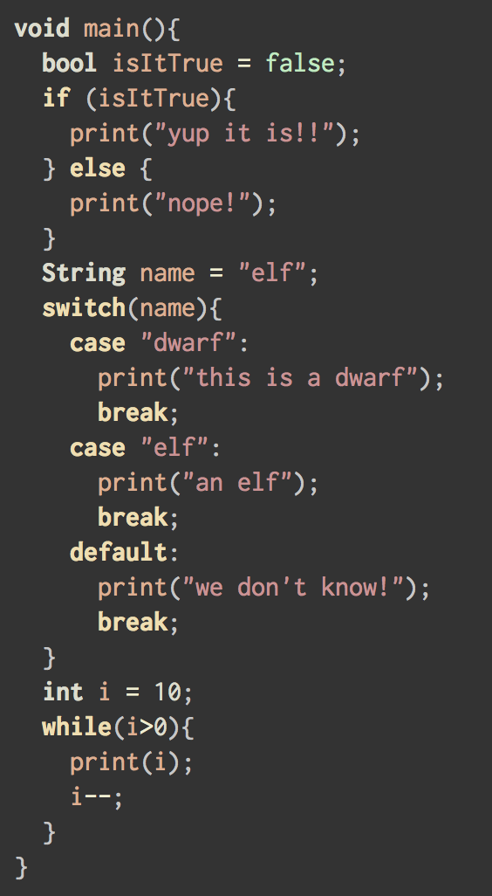
		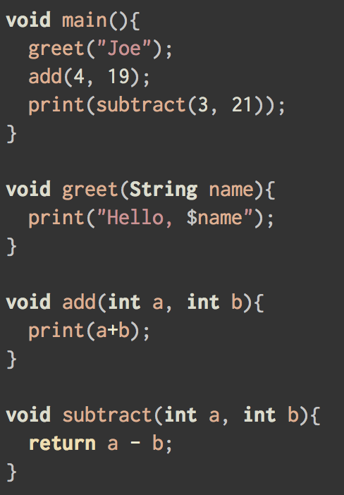
		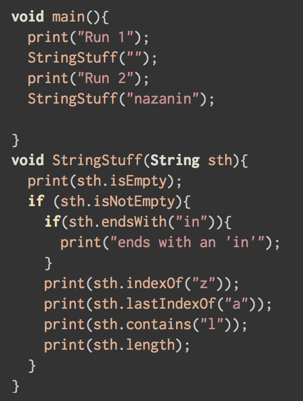
		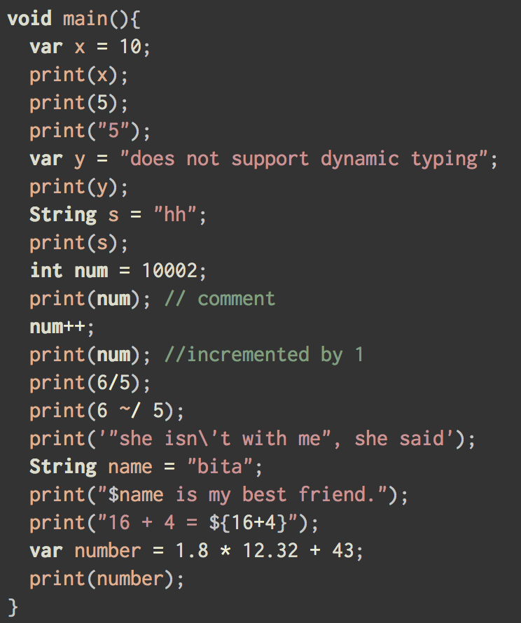
		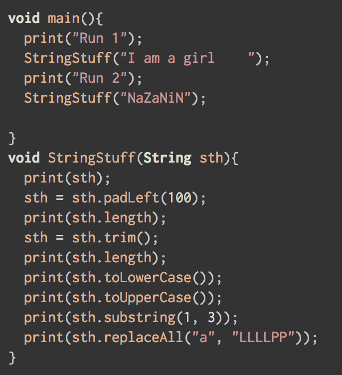
		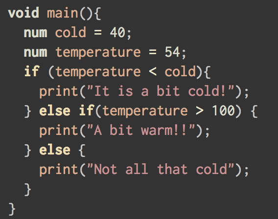
		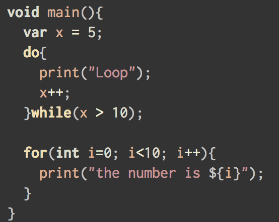
		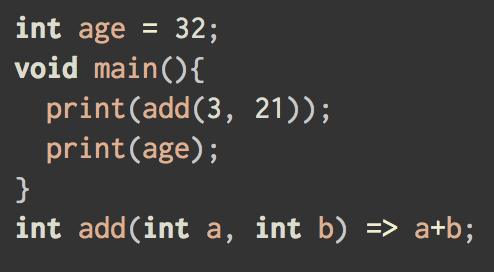
		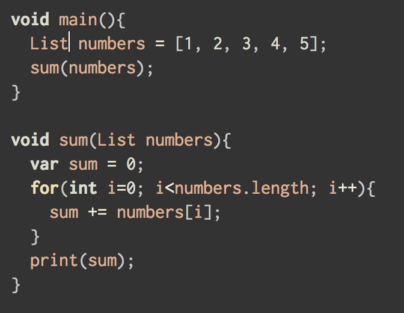
	</li>
</ol>

<h2>A Tour of Go</h2>
<ol>
  	<li>packages, variables and functions 
		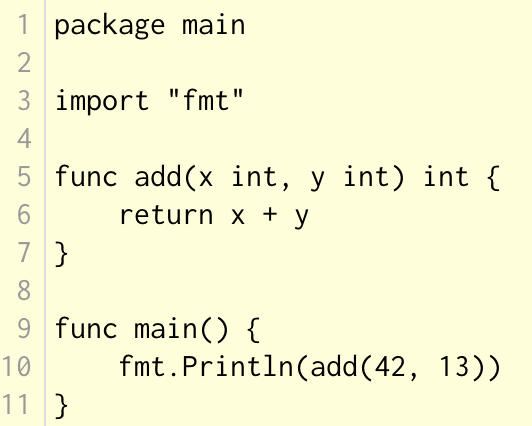
		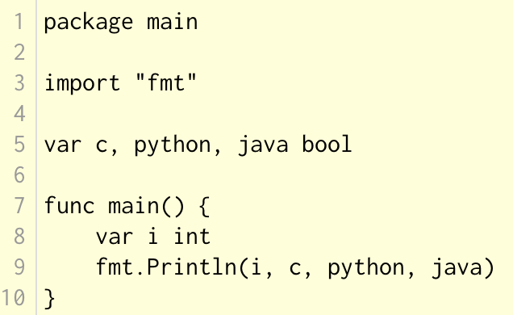
		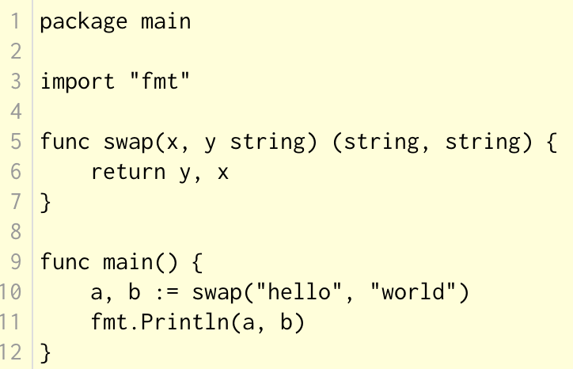
		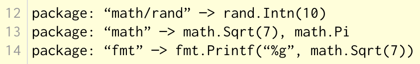
		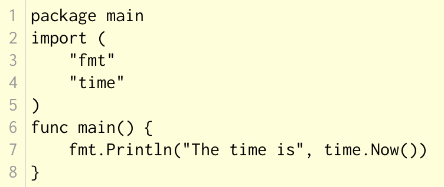
		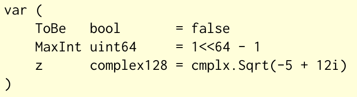
	</li>
</ol>

<h2>IoT University</h2>
<ol>
  <li>A Simple Framework for Designing IoT Products</li>
  <li>New Business Markets in the Internet of Things</li>
  <li>Unpacking the Internet of Things</li>
</ol>

<h2>Sololearn</h2>
<ol>
  <li>HTML</li>
  <li>CSS</li>
  <li>JavaScript</li>
  <li>jQuery</li>
  <li>Python</li>
  <li>C++</li>
  <li>Java</li>
  <li>Ruby</li>
  <li>SQL</li>
  <li>PHP</li>
</ol>
