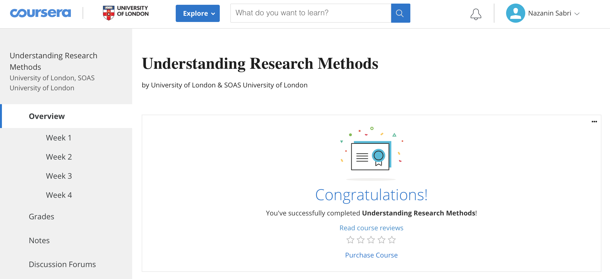

# Online-Courses

<ol>
  <li>Neural Networks and Deep Learning (Coursera)</li>
  <li>Improving Deep Neural Networks: Hyperparameter tuning, Regularization and Optimization (Coursera)</li>
  <li>Structuring Machine Learning Projects (Coursera)</li>
  <li>Convolutional Neural Networks (Coursera)</li>
  <li>Sequence Models (Coursera)</li>
  <li>Python and Statistics for Financial Analysis
	<ul>
		<li></li>
		<li></li>
	</ul>
  </li>
  <li>Understanding Research Methods
	<ul>
		<li></li>
		<li></li>
	</ul>
  </li>
</ol>
